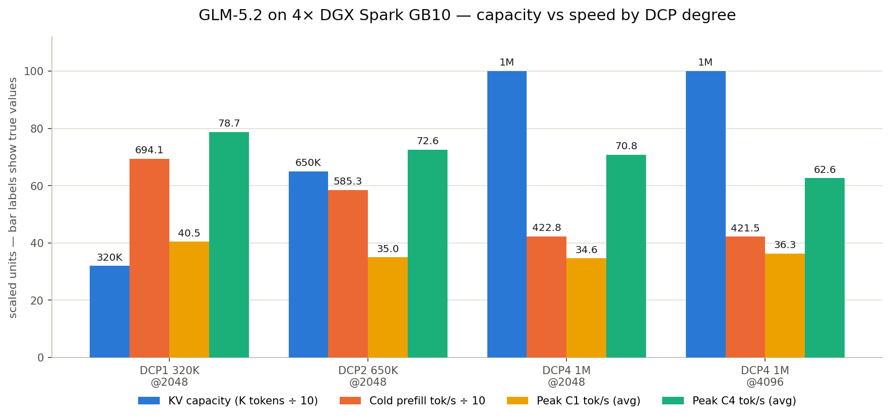

# GLM-5.2 on 4x DGX Spark GB10 — vLLM 0.27 serving recipe

*The core tradeoff, from measured data: moving DCP1 → DCP2 → DCP4 buys 3x the context
(320K → 1M tokens) for roughly 10% of peak decode throughput and about 40% of cold-prefill
throughput. Bar labels are true values; bars are scaled to share one axis. Peak figures are
averaged across the two probe passes. The rightmost pair shows why `mnbt 2048` beats `4096`:
identical context and prefill, but +13% peak C4. Full 12-configuration matrix below.*

A measured, reproducible recipe for serving **GLM-5.2** (MoE, W4A16 INT4-Marlin experts,
B12X sparse MLA attention, nvfp4 KV cache, MTP k=5 speculative decode) across **4x NVIDIA
DGX Spark GB10** nodes (sm_121a, 121GB unified LPDDR5 per node, ~273GB/s memory bandwidth,
100G RoCE fabric) on **vLLM 0.27.2.dev** with a custom overlay, at tensor-parallel degree 4.

The centerpiece is decode-context-parallelism (DCP): splitting the KV cache across ranks to
trade a small amount of decode speed for a large amount of context capacity. This repo gives
you all three usable DCP degrees on a 4-node TP4 cluster — **DCP1** (fastest, smallest
context), **DCP2** (balanced), **DCP4** (largest context) — with the full measured speed
matrix for 12 real configurations plus the launcher, patches, and operational knowledge that
got them booting and staying up.

- **[recipes/launch.sh](recipes/launch.sh)** — the env-driven launcher. Edit the config block, pick a preset, launch.
- **[recipes/presets.md](recipes/presets.md)** — copy-paste env lines for all 12 measured configs.
- **[docs/how-it-works.md](docs/how-it-works.md)** — what DCP actually does, the memory model, the step-time law.
- **[docs/patches.md](docs/patches.md)** — the three patches that make big-batch/big-KV DCP4 possible.
- **[docs/operations.md](docs/operations.md)** — UMA memory hygiene, boot discipline, the 24h watchdog spec.
- **[docs/findings.md](docs/findings.md)** — research results: chunk-size plateau, KV-is-nearly-free, the nondeterminism anomaly, open questions.
- **[benchmarks/protocol.md](benchmarks/protocol.md)** — exactly how every number below was produced.

---

## The full speed matrix

Every row was actually booted and put through the same probe battery
(`benchmarks/protocol.md`). No estimated or interpolated numbers appear in this table — where
something wasn't measured, it says `n/m`.

| config | prose C1 | C2 | prose C4 | peak C1 | peak C2 | peak C4 | prefill |
|---|---|---|---|---|---|---|---|
| DCP1 250K@2048 | 26.10 / 25.34 | n/m | 55.70 / 53.65 | 36.36 | n/m | 83.22 | 686.9 |
| DCP1 320K@2048 | 26.97 / 26.16 | n/m | 55.96 / 55.94 | 40.47 | n/m | 78.35 / 79.14 | 694.1 |
| DCP1 320K@4096 | 25.02 / 25.31 | n/m | 56.48 / 57.33 | 39.28 / 39.74 | n/m | 74.03 / 76.28 | 688.7 |
| DCP2 500K@512 | 23.96 / 24.11 | n/m | 50.52 / 52.86 | 34.16 | n/m | 72.44 | 466.5 |
| DCP2 650K@2048 | 23.45 / 24.11 | 35.6 | 51.47 / 53.65 | 35.26 / 34.67 | 50.78 | 74.12 / 71.06 | 585.3 |
| DCP2 600K@4096 | 23.40 / 23.11 | 34.92 | 51.89 / 53.03 | 37.43 / 32.44 | 44.92 | 74.98 / 73.93 | 577.0 |
| DCP4 500K@512 | 22.66 / 22.82 | n/m | 48.83 / 49.97 | 34.09 | n/m | 70.19 | 360.5 |
| DCP4 750K@1024 | 23.19 / 23.14 | n/m | 49.76 / 49.45 | 35.06 | n/m | 71.90 | 393.6 |
| DCP4 800K@2048 | 22.34 / 23.03 | n/m | 49.33 / 49.01 | 36.44 | n/m | 68.28 | 425.1 |
| DCP4 1M@512 | 22.10 / 22.06 | n/m | 48.08 / 49.29 | 33.62 | n/m | 69.73 | 361.7 |
| DCP4 1M@4096 | 22.43 / 22.19 | n/m | 49.97 / 50.54 | 37.00 / 35.66 | n/m | 64.61 / 60.67 | 421.5 |
| DCP4 1M@2048 | 21.96 / 22.54 | 34.34 | 49.12 / 48.43 | 32.55 / 36.60 | 49.45 | 68.42 / 73.23 | 422.8 |

All twelve configurations above are fully measured; the matrix is complete.

Where two values are shown (`a / b`) they are two independent runs of the same probe on the
same server instance, reported unaveraged so you can see the spread. For the peak-decode
columns the second value is the **pass of record**: peak probes read low on a freshly booted
server and recover after some uptime, so the protocol runs them twice (see
`benchmarks/protocol.md`).

**Units and protocol**, so these numbers mean what they look like they mean:
- All throughput figures are **tok/s**, measured from the vLLM **server-side counters**
  (`/metrics` deltas), not client wall-clock division — this avoids client-side measurement
  error and double-counts nothing.
- Prompts are **cache-busted** (a unique nonce per request) so prefix-cache hits never inflate
  a number.
- Noise band is **±5% at n=1-2** batteries (most rows report 1-2 repeats per probe, shown as
  `a / b`); treat single-digit-percent deltas between adjacent rows as inside the noise floor,
  not a real ranking, unless n≥3 confirms it.
- **prose** = cold, unpredictable text generation at temperature 1.0, top_p 0.95, top_k 40
  (production sampling settings) — this is the throughput you get on ordinary chat/completion
  traffic.
- **peak** = code-class, highly predictable content, which lands the adaptive MTP controller
  in its deep-k regime (more speculative tokens accepted per step) — this is close to the
  ceiling this stack can produce, not a typical-traffic number.
- **prefill** = tok/s on a cold, ~190-220K-token prompt (varies slightly per row, see
  `recipes/presets.md`/`benchmarks/protocol.md` for the exact token count per battery), gated
  to PASS (no host OOM, no timeout) before being reported.
- **C1/C2/C4** = concurrent request count at measurement time (1, 2, or 4 simultaneous
  requests). C2 was only measured on some DCP2/DCP4 rows late in the campaign — see `n/m`.

---

## Choosing a config

Three defensible choices, depending on what you're optimizing for:

- **DCP1 320K@2048 — fastest.** Best C1 and C4 decode of the whole campaign (26.97/26.16
  prose C1, 55.96/55.94 prose C4 agg), best prefill (694.1 tok/s, campaign record), 320K
  tokens of context. Pick this if your workload fits in 320K context and you want maximum
  tok/s. Caveat: this cell runs at the campaign's thinnest memory margin (1-2GB available at
  idle) — fine for benchmarking, not recommended unattended without the watchdog in
  `docs/operations.md`.
- **DCP2 650K@2048 — balanced.** Roughly 2x the context of the DCP1 preset (650K tokens) for
  about a 13% decode cost (prose C1/C4 ~23.45/51.47 vs DCP1's ~26.97/55.96) and a real but
  moderate prefill cost (585.3 vs 694.1). The middle of the tradeoff curve.
- **DCP4 1M@2048 or 1M@4096 — max context.** 1,000,000 tokens of context (the model's native
  position-embedding cap) for about a 17% decode cost relative to DCP1, and roughly half the
  prefill throughput (~422-425 tok/s). Pick this if your workload genuinely needs
  hundred-thousand-plus-token context and can tolerate the DCP4 decode/prefill tax.

The underlying shape of the tradeoff, from the matrix above:
- **Decode cost ≈ −5% per DCP doubling** (DCP1→DCP2→DCP4), fairly consistent across prose and
  peak, C1 and C4.
- **Prefill cost ≈ −20% per DCP doubling** — DCP degree, not KV size or chunk size, is the
  dominant driver of prefill throughput (each extra DCP rank means more cross-rank comm on
  the sparse-indexer merge).
- **KV amount is nearly free within a fixed DCP level.** DCP4 500K@512 vs DCP4 1M@512: doubling
  the KV budget cost nothing measurable (all deltas inside the ±5% noise band). Once you've
  paid for a DCP degree, filling its capacity ceiling is close to free.
- **`max_num_batched_tokens` (mnbt) 2048 is the sweet spot everywhere.** 4096 buys nothing on
  prose/prefill (DCP1 320K@2048 vs @4096: prefill flat, prose flat-to-down) and actively hurts
  peak C4 (DCP1: 78-79 at 2048 vs 74-76 at 4096; DCP4 1M: 62-65 at 4096, the weakest peak-C4
  figure in the whole matrix). There is no measured row where 4096 beats 2048 on anything that
  matters; see `docs/findings.md` for the full chunk-size-plateau writeup.

---

## Capacity frontier

The maximum KV (in tokens, `--max-model-len`) that actually boots per (DCP degree, mnbt)
combination on this stack, before the allocator guard refuses cleanly:

| DCP degree | mnbt 512 | mnbt 1024 | mnbt 2048 | mnbt 4096 |
|---|---|---|---|---|
| DCP1 | — | — | **320K** (350K/375K/400K all refuse) | **320K** (same ceiling as 2048) |
| DCP2 | — | — | **650K** (700K refuses) | **600K** (650K@4096 refuses) |
| DCP4 | **1M** | **1M** | **1M** | **1M** |

DCP4's ceiling is **the model's native `max_position_embeddings` cap (1,048,576)**, not
memory — DCP4 never hit a KV-driven refusal in this campaign once the profile-phase memory
bug (`docs/patches.md`, patch c) was fixed. DCP1 and DCP2 are genuinely memory-bound: they
refuse at the KV byte ceiling before they ever approach the position-embedding cap.

**Per-rank KV byte formula.** Each rank's fixed KV pool is `blocks × 2,046,464` bytes, where
`blocks = ceil(max_model_len / N)` and `N` = the number of global tokens one local KV block
covers at that DCP degree (256 at DCP4, 128 at DCP2, block size × DCP degree). See
`docs/how-it-works.md` for the full derivation and worked examples for every row in the
matrix.

**Why ~10.2-10.4GB/rank is the empirical mnbt-2048 ceiling, independent of DCP degree:** the
GLM-5.2 W4A16 checkpoint is 379GiB on disk; sharded 4 ways under TP4, that's **~94.75GiB of
weights resident per rank** — the single largest consumer of the 121GB/rank UMA budget by far.
Subtract weights, the fixed 4GiB host-OOM reserve, and a few GB of runtime/graph/system
overhead, and what's left for KV at mnbt 2048 lands at ~10.2-10.4GB/rank across every DCP
level tested — this ceiling is arithmetic, not a bug, and there is no meaningful amount of
"baseline bloat" hiding in it (see `docs/findings.md`, the "97GB mystery" writeup).

---

## Quickstart

1. Read `docs/how-it-works.md` first if you're new to DCP — it explains why `tp % dcp == 0`
   means **DCP3 is not a legal value on a TP4 cluster** (only 1, 2, 4), and what the memory
   model looks like on GB10's unified CPU/GPU RAM.
2. Build (or otherwise obtain) an image carrying the three patches in `docs/patches.md` — a
   stock vLLM 0.27 + B12X overlay will fail-closed at DCP4 and OOM during profile at any
   `max_num_batched_tokens >= 1024`.
3. Edit the config block at the top of `recipes/launch.sh` (node names, fabric IPs, model
   path, image tag — all placeholders by default).
4. Dry-run: `bash recipes/launch.sh render` — prints the exact vLLM argv this run would use,
   touches nothing.
5. Pick a preset from `recipes/presets.md` and launch for real.
6. Read `docs/operations.md` before leaving anything serving unattended — UMA memory hygiene
   and the boot-discipline gotchas in there cost real time to learn the hard way.

---

## What this is not

- **A single-cluster measurement.** Every number in this repo comes from one 4-node DGX Spark
  GB10 cluster. Fabric topology, thermal environment, driver version, and even which physical
  cores are "fast" vs "slow" on a given SoC can all shift these numbers on different hardware
  of the same nominal spec.
- **One checkpoint.** All measurements use a specific W4A16 INT4-Marlin GLM-5.2 checkpoint
  (with an int8 lm_head sidecar) derived from the QuantTrio quantization lineage (see Attribution
  below). A different checkpoint, quantization, or GLM-5.2 fine-tune will produce different
  numbers, possibly substantially different ones.
- **Not upstream-official.** This is not an NVIDIA, Zhipu/Z.ai, or vLLM-project-endorsed
  recipe. It is one team's overlay on top of vLLM 0.27, built to make a specific checkpoint
  serve well on specific hardware.
- **The guard patches in `docs/patches.md` are ours** — written against this overlay's source
  tree to fix bugs found during this campaign. They are not upstream vLLM patches and have not
  been submitted upstream; treat them as a documented workaround, not a vLLM changelog entry.
- **Not a determinism guarantee.** `docs/findings.md` documents an open, unresolved
  temperature-0 nondeterminism anomaly on this stack. If your application depends on bit-exact
  reproducibility at temp 0, read that section before you rely on it.

## Attribution

- The base quantized checkpoint lineage and initial TP4/DCP2 4x-DGX-Spark launch work this
  recipe builds on originates from the community
  [`GLM-5.2-QuantTrio-TP4-DCP2-4x-DGX-Spark`](https://github.com/joesinvestments/GLM-5.2-QuantTrio-TP4-DCP2-4x-DGX-Spark)
  repository (contributors including CosmicRaisins, penguinchang, tonyd2wild, danielwoz).
- Community GB10/vLLM engineering referenced during this work includes
  [`ciprianveg/gb10-vllm`](https://github.com/ciprianveg/gb10-vllm) (built on
  `local-inference-lab/vllm@gilded-gnosis-v18-final` and `voipmonitor/b12x`) and
  [`drowzeys/vllm-gb10-spin-wait-fix`](https://github.com/drowzeys/vllm-gb10-spin-wait-fix)
  (spin-wait analysis originally by nacyot).
- Where a fix traces to an upstream vLLM pull request, the PR number is cited inline in
  `docs/findings.md` and `docs/patches.md` (e.g. vllm-project/vllm PRs #45964, #50904, #15946,
  #44993, and the tracking issue #46654 for ongoing GLM-5.2 upstream performance work).

## License

MIT — see `LICENSE`. This repository's own code (the launcher, docs, and patch descriptions)
is MIT licensed; it does not relicense vLLM, the GLM-5.2 model weights, or any third-party
repository referenced above, each of which carries its own license.
